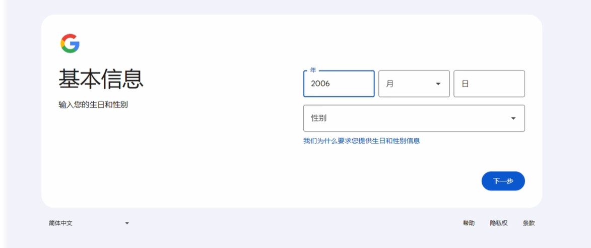
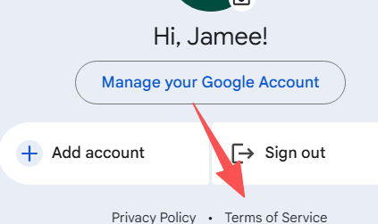
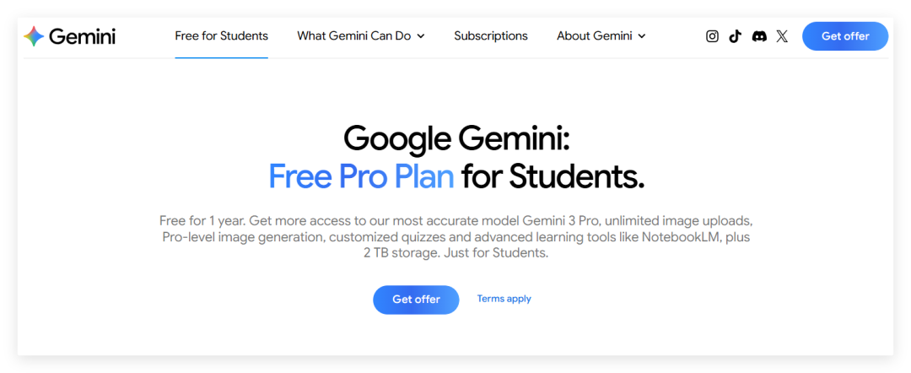
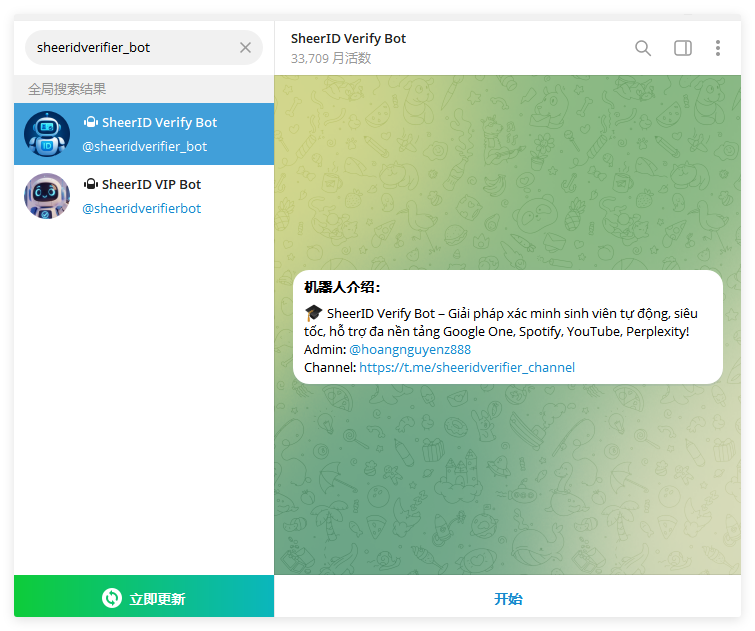
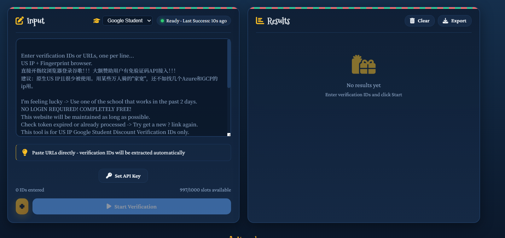
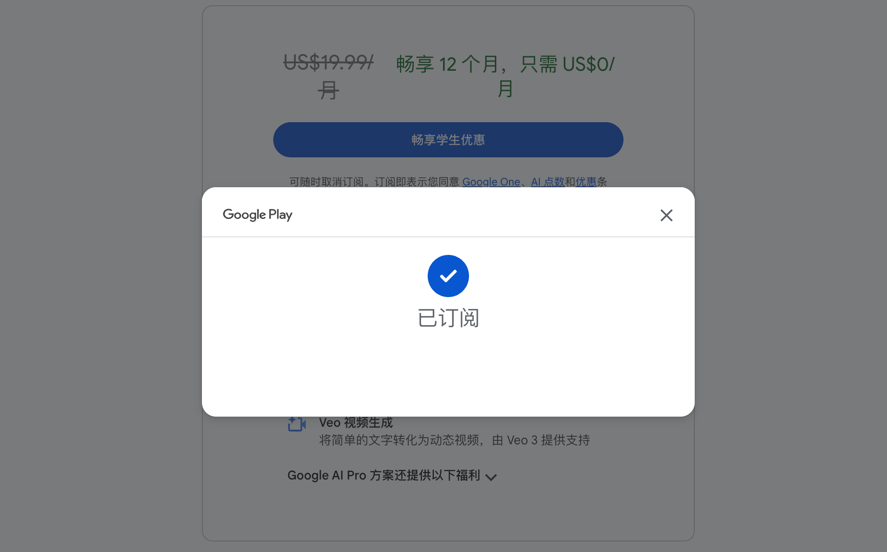
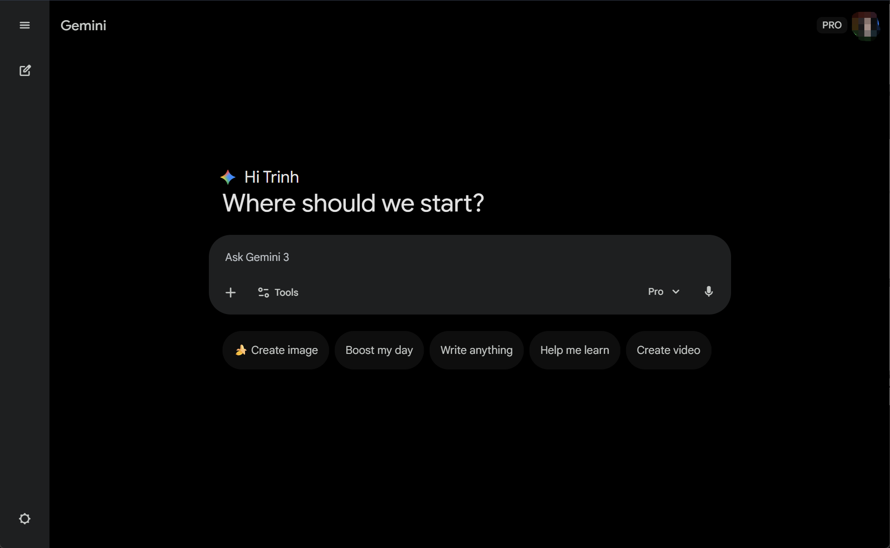

# Gemini 3 Pro 学生认证 
教程编写不易方法保可行，可以通过TG/discord联系我。推荐的加速器是个人使用体验较好客服回复较快的。

想要白嫖，首先得具备以下几个条件,最基本[科学上网🔍白羊加速](https://baiyangjiasu.com/register?invite=sqBwL69m)。不然无法注册谷歌账号。

1.你的 Google 注册地址是支持 # Free Pro Plan for Students. 没有这类邮箱的看下一篇google邮箱注册。

2.你得有[魔法🔍白羊加速](https://baiyangjiasu.com/register?invite=sqBwL69m)

3.你得有TG 可以在可在博客主页[discord](https://discord.gg/w9qgVVSkB)联系我帮你。

4.虚拟卡网上有能用的，可以咸鱼买个。

白嫖流程很简单，可以比闲鱼立省 80多。

---

## 步骤一：登录google账号
看情况选择是否使用教育邮箱：https://accounts.psu.edu/create/new
使用[指纹浏览器](https://www.adspower.net/)防止Google访问你本地信息导致认证失败

1. **准备工作**：
   * 准备一个 **Google 账号**。
   * 谷歌官网：[Google.com](google.com)
   * 确保网络环境处于支持的地区（如新加坡、美国、台湾等）。
  注：关于IP纯净度的这一块选各个网站测试的其实都很假选择国外节点不是万人骑的节点就可以了("ip111.cn")三个ip必须全在国外且ip地址相同,翻墙代理我推荐[🔍白羊加速](https://baiyangjiasu.com/register?invite=sqBwL69m)配置了海外家庭地址网络稳定。
2. **访问官网**：
   * 访问 [gemini.google.com](https://gemini.google.com)。
   * 注册账号时：年龄选择要符合学生身份年龄推算下在18-25周岁之间这里讲的是没有账号的朋友需要注册。有账号去改下账号年龄什么试一下。  

3. **注册玩账号或老帐号确认地区！！！重要**：
   * 用于谷歌浏览器
    谷歌浏览器右上角！！！不是最上面呢个。在书签栏下面有个头像展开下面有服务条款查看地区。
    
    确认是美国就行不是美国使用：https://policies.google.com/country-association-form 
    更改地区。改区注意事项，当前IP地址在哪里就该到哪里。
    非谷歌浏览器的使用上面该区链接直接该区，因为都是翻墙出国很少能保持地址确定性，老帐号因使用时间较长改区可能不成功建议注册新号尝试。
---

## 💻 步骤二：添加信用卡申请学生优惠
信用卡获取渠道：咸鱼超过8块就别买，价格区间在3-8元/也可以使用虚拟信用卡：
https://www.bitget.com/zh-CN/verified/enter

1. **登录平台**：
   * 访问 [https://gemini.google/students/](https://gemini.google/students/)。
    
   * 首先登录 Gemini [学生认证界面](https://gemini.google/students/)， 点击【Get Offer】
   * 后一步直接点继续即可。
2. **进入认证环节**：
   * 方法1：使用https://accounts.psu.edu/create/new注册的教育邮箱填写信息注册。
  最简单的方法。注意点在注册学生账号地址时尽量要跟账号一样。
   * 方法2：使用TG的自动认证机器sheeridverifier_bot 。将认证的呢一长串url丢过去。
  sheeridverifier_bot 
   
   * 方法3：https://batch.1key.me/    验证器但需轻质捐款。不如去两元买个稳定划算使用方法就是验证学校的链接丢给他。
   
3. **使用上述三种方法**：
   * 后基本就解决了你就可以到达。
    
4. **接下来就可以**：
   * 你好 Gemini**。
   

---

## 💡 使用小贴士

### 1. 区域限制（Region Lock）
后续使用过程中的访问时提示 请检查节点设置。推荐使用以下地区尽量使用下属的[代理节点](https://baiyangjiasu.com/register?invite=sqBwL69m)：
* **亚洲**：新加坡、台湾、日本、韩国。
* **美洲**：美国、加拿大。

### 2. 顺手点点
* **结构化提问**：Gemini 3 Pro 对逻辑敏感。使用 `###` 标题或 `1. 2. 3.` 列表来组织你的指令。
*  顺手把https://aistudio.google.com/api-keys注册了有免费的api额度。

---
