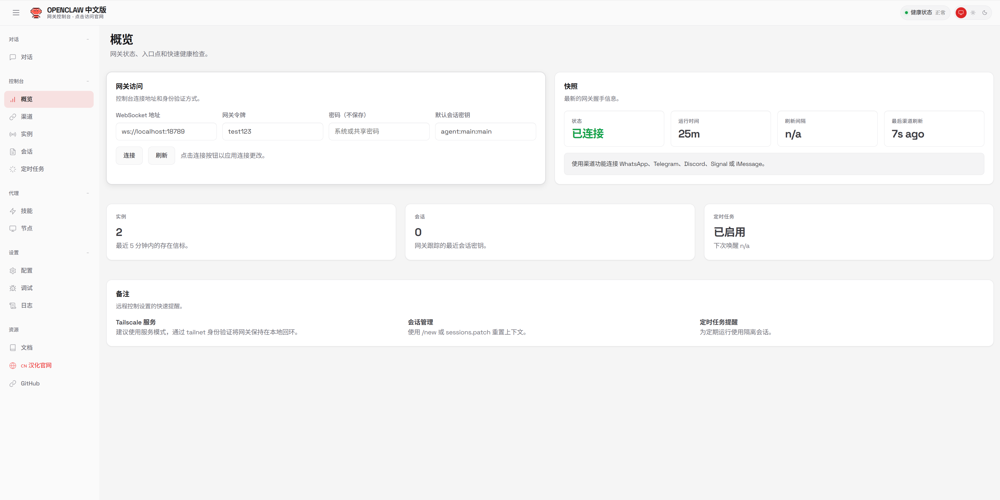

# clawdbot中文版安装教程

推荐安装官方版本，分发版本保证安全性。但安装思路是一样的。只做教程分享如下载的版本包含病毒或后门程序等于本人无关。(无攻击汉化作者的意思，仅提醒网友安装高权限程序需注意设备安全风险)

介绍：

clawdbot是一个开源的个人 AI 助手平台（GitHub 120k+ Stars），可以通过 WhatsApp、Telegram、Discord 等聊天软件与 AI 交互。简单说就是：在你自己的机器上运行一个 AI 助手，通过常用聊天软件跟它对话，| [github地址中文版地址](https://github.com/MaoTouHU/OpenClawChinese)|

## 安装前提

 * 建议安官方版本。
 * 权限较高的环境建议使用wsl或者虚拟机安装
 * 准备好要使用的API Gemini 3 pro有免费的api额度综合能力比国产模型还是强很多
 * 账号本处不做链接国外app的教程（不便展示具体博客内自学一下）
 * 配置国外网app连接时[网络加速](https://baiyangjiasu.com/register?invite=RWqaczzt)或者[🔍白羊加速](https://baiyangjiasu.com/register?invite=RWqaczzt)(点击就到)
  
## 安装效果

本地端口访问：http://localhost:18789

## 安装方式

### 方法一：自动一键安装推荐新手

最简单的方式，下载执行脚本自动完成安装。但注意配置好镜像源这些，如果你在电脑安装过之前的全英文版建议先参考：[完全卸载](https://docs.openclaw.ai/install/uninstall#linux-systemd-user-unit)

**Linux / macOS：**

```
curl -fsSL -o install.sh https://cdn.jsdelivr.net/gh/OpenClawChinese@main/install.sh && bash install.sh
```
**Windows:**
```
Invoke-WebRequest -Uri "https://cdn.jsdelivr.net/gh/OpenClawChinese@main/install.ps1" -OutFile "install.ps1"; .\install.ps1
```

脚本会自动：

检查 Node.js 版本

安装中文版 npm 包

尝试运行初始化配置

### 方法二：npm 手动安装

更推荐手动安装，因为可以学习点环境配置的内容。ai不是万能的，要有自己解决问题的能力。

```
 # 稳定版（推荐）
  npm install -g @qingchencloud/openclaw-zh@latest

 # 或者 nightly 版（每小时同步上游最新代码）
  npm install -g @qingchencloud/openclaw-zh@nightly
```
验证安装：
```
openclaw --version openclaw --help

# 如果--help输出是中文，说明安装成功
```
### 方法三：Docker 部署

普通用户使用虚拟机开个就差不多可以了数据本地可控，放在服务器上一个月服务器成本20-50元不等，再加上api费用不划算。富公当没看到。

#### 方式 1：一键部署脚本（推荐）
项目提供了一键部署脚本，自动完成环境检测、初始化、配置远程访问：
```
# 自动生成
 Token curl -fsSL https://cdn.jsdelivr.net/gh/OpenClawChinese@main/docker-deploy.sh | bash

# 或者指定 
Token curl -fsSL https://cdn.jsdelivr.net/gh/OpenClawChinese@main/docker-deploy.sh | bash -s -- --token 你的密码

# 仅本地访问（不配置远程） 
curl -fsSL https://cdn.jsdelivr.net/gh/OpenClawChinese@main/docker-deploy.sh | bash -s -- --local-only
```
脚本会自动：

检查 Docker 环境

拉取镜像

创建数据卷

初始化配置

配置远程访问（Token 认证）

启动容器

#### 方式 2：手动配置步骤
手动控制每一步：

```
# 1. 创建数据卷 
docker volume create openclaw-data 

# 2. 初始化 
docker run --rm -v openclaw-data:/root/.openclaw \ ghcr.io/1186258278/openclaw-zh:nightly openclaw setup

# 3. 配置网关模式
 docker run --rm -v openclaw-data:/root/.openclaw \ ghcr.io/1186258278/openclaw-zh:nightly openclaw configsetgateway.modelocal

# 4. 配置远程访问（允许局域网访问） 
docker run --rm -v openclaw-data:/root/.openclaw \ ghcr.io/1186258278/openclaw-zh:nightly openclaw configsetgateway.bind lan 

# 5. 设置访问令牌（重要！远程访问必须） 
docker run --rm -v openclaw-data:/root/.openclaw \ ghcr.io/1186258278/openclaw-zh:nightly openclaw configsetgateway.auth.token 你的密码 

# 6. 启动容器 
docker run -d \ --name openclaw \ -p 18789:18789 \ -v openclaw-data:/root/.openclaw \ --restart unless-stopped \ ghcr.io/1186258278/openclaw-zh:nightly \ openclaw gateway run

```
访问http://服务器IP:18789，在「网关令牌」输入框填入你设置的 Token，点击连接即可。

#### 方式 3：Docker Compose
项目提供了docker-compose.yml：
```
# 下载配置文件 
curl -fsSL https://cdn.jsdelivr.net/gh/OpenClawChinese@main/docker-compose.yml -o docker-compose.yml

# 配置文件内容：

version:'3.8' services: openclaw: image:ghcr.io/1186258278/openclaw-zh:nightly container_name:openclaw ports: -"18789:18789" volumes: -openclaw-data:/root/.openclaw environment: -OPENCLAW_GATEWAY_TOKEN=${OPENCLAW_GATEWAY_TOKEN:-} restart:unless-stopped command:openclawgatewayrun--allow-unconfigured volumes: openclaw-data: name:openclaw-data
```
首次需要初始化配置：

```
# 启动容器（首次会自动创建卷） 
docker-compose up -d 
# 初始化配置 
docker-composeexecopenclaw openclaw setup docker-composeexecopenclaw openclaw configsetgateway.modelocal 

# 远程访问配置（可选） 
docker-composeexecopenclaw openclaw configsetgateway.bind lan 

docker-composeexecopenclaw openclaw configsetgateway.auth.token 你的密码 

# 重启生效 
docker-compose restart
```

## 首次配置

安装完成后，需要进行初始化配置。

运行初始化向导
```
openclaw onboard
```
这是一个交互式向导，会引导你完成：

* 选择 AI 模型：支持 Claude、GPT、本地模型等

* 配置 API Key：根据选择的模型输入对应的 API Key

* 设置聊天通道：可以连接 WhatsApp、Telegram 等

* 创建助手人格：给你的 AI 起个名字，设置性格

整个过程都是中文界面，跟着提示走就行。

安装守护进程（可选）
如果希望 OpenClaw 在后台持续运行：
```
openclaw onboard --install-daemon

```
常用命令速查
```
openclaw # 启动（交互模式）

openclaw onboard # 初始化向导 

openclaw config # 查看配置 

openclaw configsetkey val# 修改配置

openclaw skills # 管理技能插件 

openclaw status # 查看运行状态 

openclaw gateway run # 启动网关（Dashboard）
```
## 升级更新

```
npm update -g @qingchencloud/openclaw-zh
```

## 扩展插件

```
# 安装更新检测插件
npm install -g @qingchencloud/openclaw-updater
```

**可以的话去GitHub给我点个star，我一定努力更新**

如有其他问题可以滴我解答：也可以

[安装问题排查手册](https://github.com/MaoTouHU/OpenClawChinese/blob/main/docs/FAQ.md)