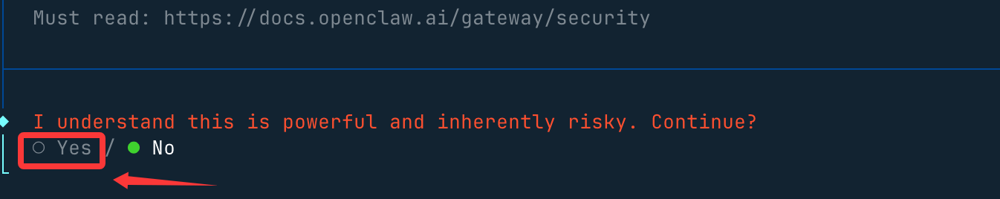
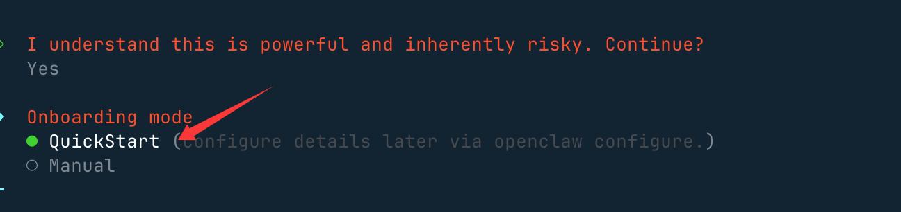
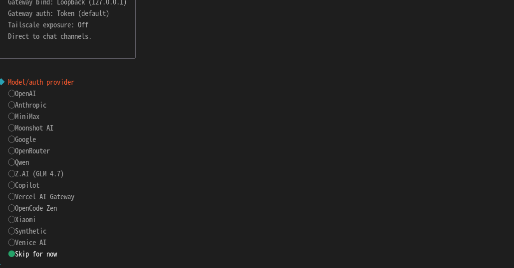
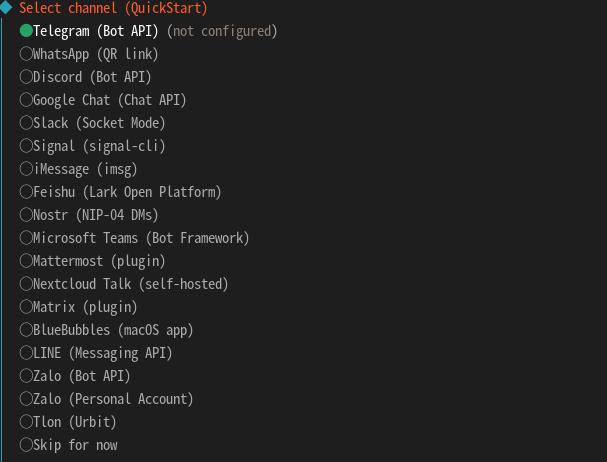
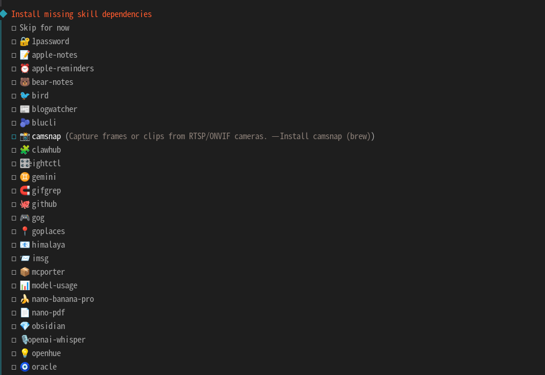
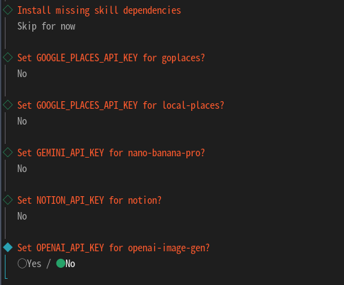
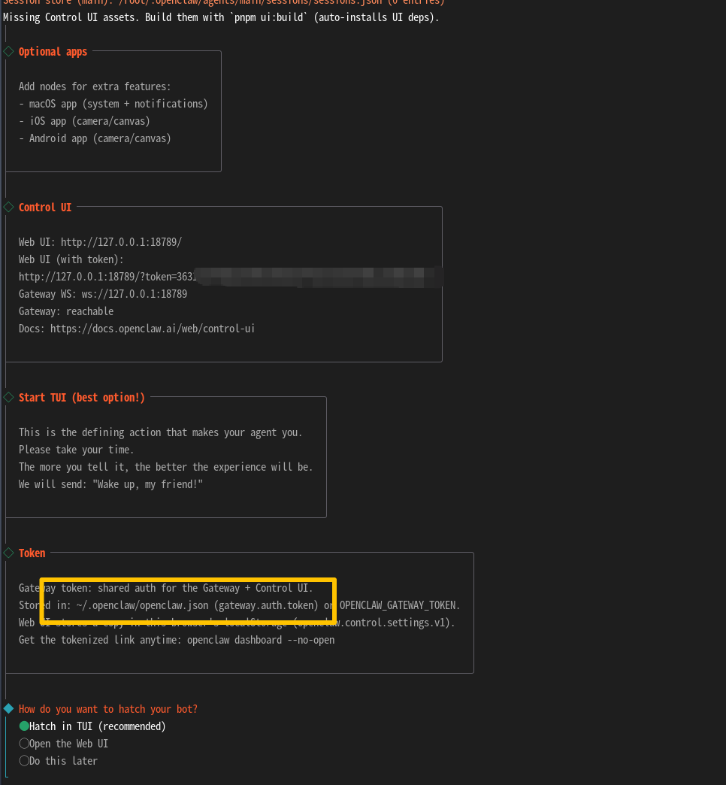
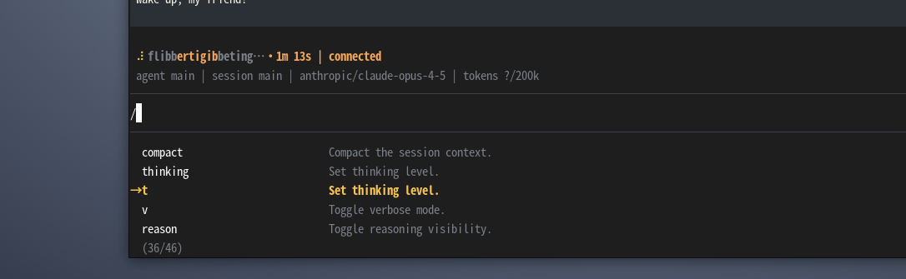
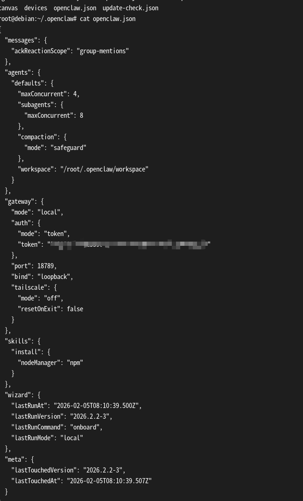

# 本地ollama连接moltbot
**Moltbot** 是一款运行在个人设备上的_个人 AI 助手，因此会具有较高的系统权限。去执行部分系统命令，因此在考虑到省钱的前提下我们使用本地虚拟机安装该服务。
ollama登录需要连接外网，主页有提供推荐加速[🔍白羊加速](https://baiyangjiasu.com/register?invite=BO3BUDrb)(点击就到)。
## 虚拟机安装
选择VMware或者 VirtualBox安装（建议VMware资源占用率低很多）。这里我为什么不跟其他博主一样推荐wsl2安装呢，原因有一下三点。
	1.虚拟机的快照可以帮你快速回滚回之前步骤，避免因失误需重头再来。
	2.虚拟机的网络配置会更方便，直接使用桥接网络避免很多网络冲突导致的报错。
	3.通用性，不管是什么系统虚拟机安装起来步骤差不多就下个普通软件一样，保持一致弄熟在考虑其他地方可以渐少环境配置的摸索成本。
下载官网：
	vmware下载地址：https://www.vmware.com
	VirtualBox下载地址：https://www.virtualbox.org
## 安装Moltbot
使用官方推荐的一键安装脚本避免安装其他内容占用系统资源。

！！！！！！！！！不要一路无脑yes，能跳过跳过跳不过的填入api的这种选no。
```
curl -fsSL https://openclaw.ai/install.sh | bash

# 如没有安装curl需要apt install curl

# 或者安好npn后
npm install -g openclaw@latest

# 一键安装好像是自动初始化，为写教程次数有点多记不清了。如果每日一进入初始化就手动
openclaw onboard
```


然后，会提醒你这个龙虾能力很强，当然风险也很大，我们选 yes（no 就不安装了） 就好了

接下来我们就选快速启动 QuickStart 选项：
后面需要选择使用的模型api，这里需要注意的是我们需要使用本地的模型测试，会跳过安装。

选择跳过后会有两个选线都选默认然后我们来到选择输出的地方
选择跳过我们后面在配置。

后面基本按照第一个选项一路路灯给他先按上我们再去config里调整，在整个安装过程中需要你自己看你有什么的api然后去选择，我这里是打算全用本地所以没配置任何api或者调用接口。

这里有20多个skill，如果你不知道是干什么的那看情况选可以先去搜下是干什么的在说也可以先跳过需要什么安什么主打一个轻量化。

然后会问你添加很多api有就yes跟提示走没有就no跳过就完事了。

后续他会提示我们选择什么方式绘画我们按默认的就可以。框框的地方后续可以在呢添加api以及其他配置文件

这样就算安装完成了，后续需要添加本底ollama的apikey和自己聊天的key。但是本处我只尝试使用ollama的api key。


## 配置链接本地ollama

安装完成后打开~/.openclaw/openclaw.json文件可以修改核心的api配置等内容。

```
# 安装vim（根据个人喜好可使用nano）
	apt install vim #选择Y安装后编辑文件~/.openclaw/openclaw.json

  "agent": {
    "model": "ollama/deepseek-r1:7b",
    "temperature": 0.7,
    "maxTokens": 4096
  },
  "models": {
    "ollama": {
      "baseURL": "http://localhost:11434/v1",
      "apiKey": "ollama",
      "timeout": 120000,
      "models": {
        "deepseek-r1:7b": {
          "contextWindow": 8192
        },
        "qwen2.5:7b": {
          "contextWindow": 32768
        }

# 注意格式跟缩进
# ollam建议安装在本地的主机上能更好的动态提供计算资源。如果在虚拟机内安装ollam可能配置会容易些# 但是容易提高虚拟机资源占用率可能会卡顿或虚拟机崩溃。

```
完整的配置示例
```
{
  "meta": {
    "lastTouchedVersion": "2026.2.6-3"
  },
  "models": {
    "providers": {
      "host-ollama": {
        "baseUrl": "http://192.168.0.104:11434/v1",
        "apiKey": "ollama",
        "api": "openai-completions",
        "models": [
          {
            "id": "qwen3-vl:32b",
            "name": "Qwen3 VL 32B",
            "contextWindow": 32000
          },
          {
            "id": "qwen2.5-coder:32b",
            "name": "Qwen2.5 Coder 32B",
            "contextWindow": 32000
          },
          {
            "id": "qwen3-coder-next:latest",
            "name": "Qwen3 Coder Next",
            "contextWindow": 32000
          },
          {
            "id": "glm-4.7-flash:q8_0",
            "name": "GLM 4.7 Flash",
            "contextWindow": 32000
          }
        ]
      }
    }
  },
  "agents": {
    "defaults": {
      "model": {
        "primary": "host-ollama/qwen3-vl:32b"
      },
      "workspace": "/root/.openclaw/workspace",
      "maxConcurrent": 4
    }
  },
  "commands": {
    "native": "auto",
    "nativeSkills": "auto"
  },
  "gateway": {
    "port": 18789,
    "mode": "local",
    "bind": "lan",
    "controlUi": {
      "enabled": true,
      "allowInsecureAuth": true
    },
    "auth": {
      "mode": "token",
      "token": "5b7523ed8d8cdb51d746db5c487f6139b3246ff7fd932625"
    },
    "trustedProxies": ["0.0.0.0/0"],
    "tailscale": {
      "mode": "off",
      "resetOnExit": false
    }
  },
  "skills": {
    "install": {
      "nodeManager": "npm"
    }
  },
  "messages": {
    "ackReactionScope": "group-mentions"
  }
}

```
安装好本地模型确保虚拟机于主机可以通信，要能双向通信单向通信是不行的。
然后在配置文件内按要求修改信息。

```
# 这将是你用的最多的命令

openclaw gateway stop
openclaw gateway run

```

最后

```
# ok到这里你想浏览器打开那一定也要看这个。

在访问时带上token ！！！！！！填你自己的别复制我的
http://127.0.0.1:18789/?token=5b7523ed8d8cdb51d746db5c487f6139b3246ff7fd932625


# 启动网关
moltbot gateway --port 18789 --verbose

# 测试本地模型
moltbot agent --message "你好，请介绍一下你自己" --model ollama/deepseek-r1:7b

# 使用通义千问
moltbot agent --message "什么是人工智能?" --model ollama/qwen2.5:7b

# 代码生成
moltbot agent --message "写一个 Python 快速排序" --model ollama/deepseek-coder:6.7b

```
## 注意事项
可能遇到的问题：主机不放行流量导致虚拟机无法连接到本地。
没讲连接到社交软件，因为方便点的需要翻墙等不便展示有需要的可以滴我，稳定加速看主页
```
netsh advfirewall firewall add rule name="Ollama VM Only" dir=in action=allow protocol=TCP localport=11434 remoteip=192.168.137.0/24最好配置静态ip
```
## 坑点

* 第一次安装没成功然后选择ctrl+c跳过可能会没有配置文件，这时直接重新初始化吧
* 浏览器使用记得带token
* 第一次测试时别把模型拉太满，我就是拉太满半天出不来内容。
* 模型选择哪里他默认会是openai的模型需要手动调整也可以配置agent自己选择。
* 最后的最后，奉劝使用虚拟机部分环境导致冲突了恢复快照。比你去整环境能快一点你可能遇到非常多的的意外。